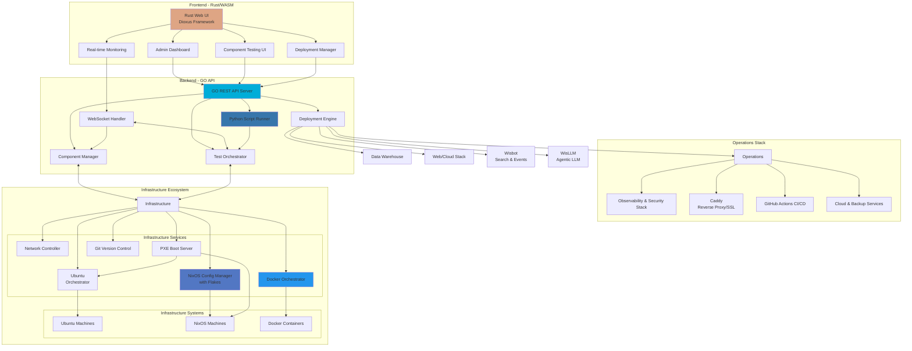

# autobox

Rust, GO, Python, NixOS, and Docker driven Orchestration Box for Setting up Business-as-Code, Managing local Automation and Setting up Custom Network Configurations.

## Target Local Systems

- pFSense Gateway/Firewall
- NixOS Linux Servers
- Docker Containers

## Requirements

- Use GO to develop Webserver Resources and REST API
- Use Python to develop Scripting and Automation
- Use Rust and Dioxus to develop GUI Resources
- Use NixOS to develop OS & Networking Configurations and Package Mangement (using Nix Flakes for reproducibility)
- Use Docker to develop Container Configurations
- Use PXE to access devices on LAN
- Use Git, NixOS (flakes), and Docker for Version Control
- Use any Git repository for Code Hosting
- Use GitHub Actions for CI/CD

## Features

- Test Local Firewall Rules & Configurations
- Test Local NixOS Configurations
- Test Local Docker Container Configurations
- Test Local Network Routes & Configurations
- Deploy Business-as-Code Applications
  - Application List
    - Caddy for Reverse Proxy and SSL Certificate Management
    - Wisbot for Search, LLM Orchestration, Event Management and Automation
    - WisLLM for Agentic LLM Management
    - Data Warehouse for Data Storage and Management
    - Web/Cloud Stack for Web Applications
    - Nextcloud for Local Cloud and File Management
    - NocoDB for Project Management
    - Grafana for Monitoring and Visualization
    - Authentik for Authentication and Authorization
    - WireGuard for VPN
- Setup Automated Backups of deployed systems with a selected cloud provider (Digital Ocean, Vercel)
- Use Cloudflare for DNS, SSL, and CDN

## Autobox Admin Web Application Architecture

### Admin Application Flow

